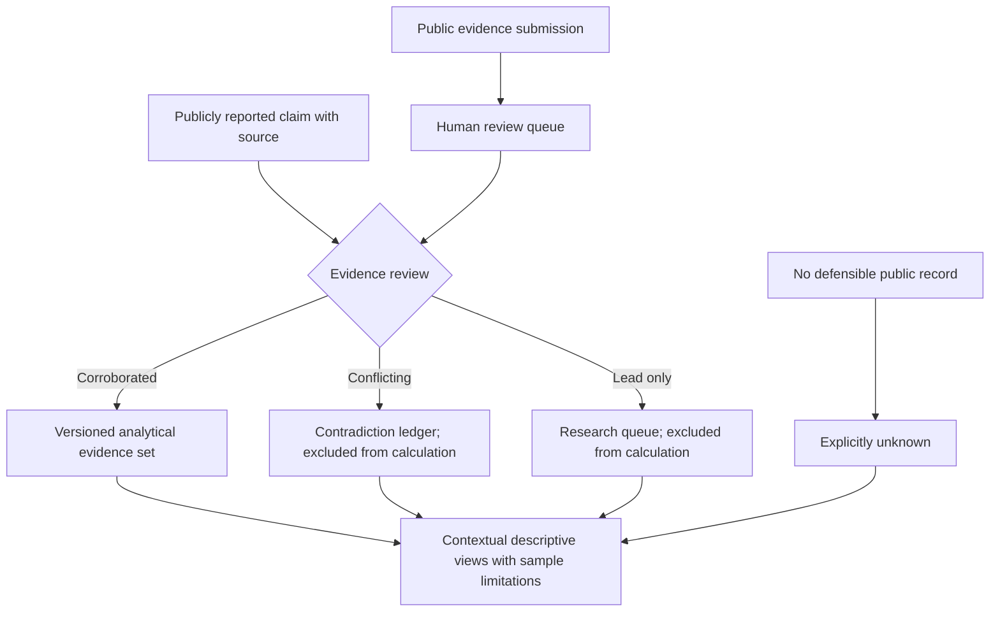

# Nobel Blood Atlas | Evidence-first research interface

This is an **experiment in presenting sparse, selectively reported public evidence**. It must not imply that reported blood-type records are representative of Nobel laureates or support biological explanations of achievement. [Public showcase README](../README.md).

## Public evidence workflow

This diagram describes the **documented public research procedure**, not proof of independent medical verification, a complete dataset, or the private database's implementation.

## Example: distinguish evidence states without revealing anyone's blood type

| Hypothetical source situation | Appropriate status | Effect on analysis |
| --- | --- | --- |
| No attributable public record found | Unknown | Never impute from nationality, name or other personal attributes. |
| A single unsupported or indirect mention | Lead / awaiting review | Exclude from corroborated comparisons. |
| Two sources assert inconsistent types | Conflict | Retain both source trails and exclude rather than vote by frequency. |
| Public records meet the project's specified corroboration rule | Corroborated public report | Eligible for a **descriptive screened-sample** view; not necessarily independently medically verified. |
| A visitor submits a new claim | Pending human review | Must not automatically change public counts or downloads. |

**Visual interpretation requirement:** Any ABO chart must show the screened denominator, the corroborated denominator, the missing/unknown share, source-date or data-edition label, and the fact that the reporting sample is non-random. A population baseline is context, not an exchangeable control population. Do not infer a link between blood type and laureate achievement.

## Screenshot and data-release checklist

No actual application screenshot is included. An approved capture must be taken from the **public evidence-summary or methodology view** and checked for pending submissions, personal contact details, moderation interfaces, unpublished claims, and identifiable health information not approved for publication. Show the version and date. Do not substitute a mock-up for an application screenshot.

The README identifies a [public application](https://nobel-blood-atlas.aryakia97.chatgpt.site); this review did not establish its current live availability.

## GitHub About fields — proposed, not applied

- **Description:** `Evidence-graded research dashboard illustrating missingness, conflicting reports and provenance in sparse public data.`
- **Topics:** `evidence-mapping`, `data-quality`, `research-dashboard`, `provenance`, `data-visualization`
- **Homepage:** use the public app URL only after verifying current public accessibility.

No individual medical record, private data, application code, credentials or unpublished material is transferred by this document.