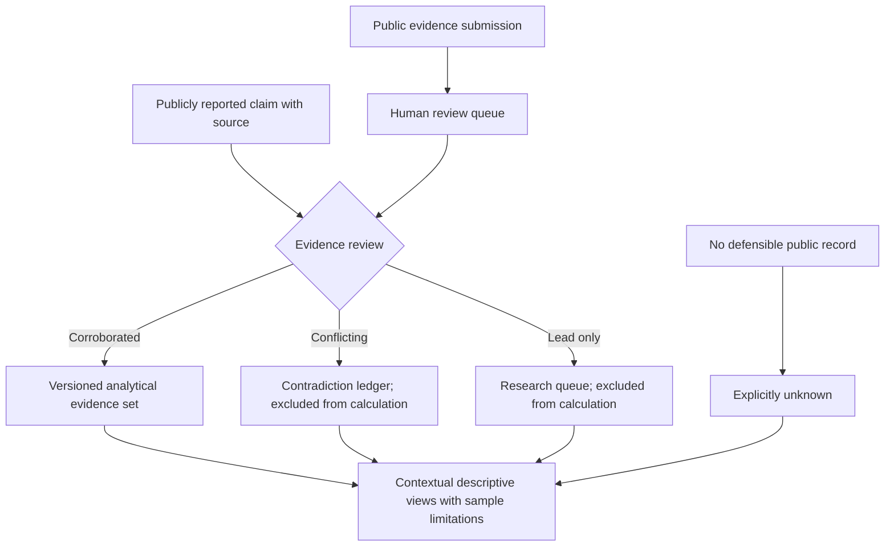

# Nobel Blood Atlas | Evidence-first research interface

This showcase is an **experiment in handling sparse, selectively reported public evidence**. It must not imply that reported blood-type records are representative of Nobel laureates or support biological conclusions about achievement.

## Public evidence workflow

**What this does not establish:** dataset completeness, independent medical verification, a representative sample, or associations between blood type and prizes. The existing [public README](../README.md) explains evidence grades, contradictions and missingness; this diagram visualizes that description, not private database structure.

## Public demonstration and safe screenshot criteria

The README identifies a [public research application](https://nobel-blood-atlas.aryakia97.chatgpt.site), but its live status has not been verified in this PR. No real screenshot is attached. Any future capture must exclude personal contact information, unreviewed submissions, private administrative screens and undisclosed medical records; favor the public methodology and evidence-summary views.

## Suggested GitHub About fields (not applied)

- **Description:** `Evidence-graded research dashboard illustrating missingness, conflicting reports and provenance in sparse public data.`
- **Topics:** `evidence-mapping`, `data-quality`, `research-dashboard`, `provenance`, `data-visualization`
- **Homepage:** use the publicly verified app link above only after confirming it remains accessible.

No private data, credentials, unpublished material, or application source are transferred by this document.