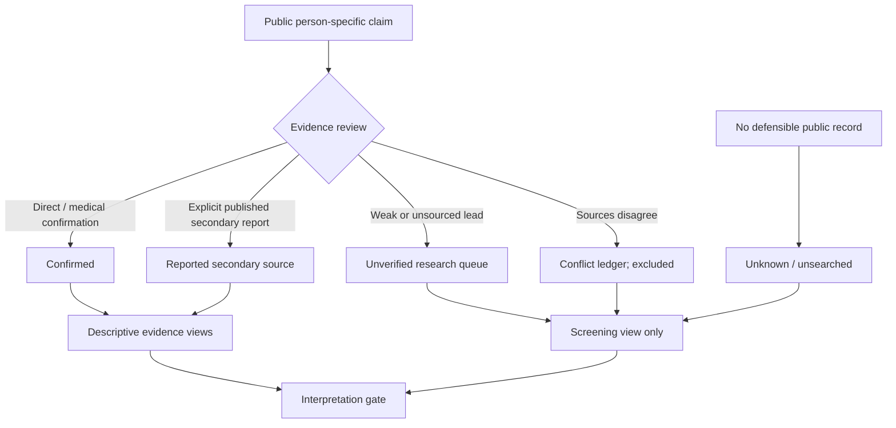

# Nobel Blood Atlas | Evidence-first research interface

Nobel Blood Atlas is an experiment in presenting sparse, selectively reported public evidence without turning a screening sample into a census.

The public GitHub Pages release now includes the screening ledger, evidence-state counts, contradiction ledger, population baselines, methodology and research notes. The active public terminology is:

- **confirmed:** 0
- **reported secondary source:** 4
- **unverified:** 15
- **conflicting / excluded:** 3
- **unknown or unsearched:** 970
- **person-laureate denominator snapshot:** 992

“Reported secondary source” does **not** mean medical confirmation.

## Public evidence workflow

## What the interface is designed to communicate

1. Every displayed person-level claim retains its source and source type.
2. Stronger public reports are separated from compilation leads.
3. Contradictions remain visible and are excluded from calculations.
4. Missingness remains visible through the full 992-person denominator frame.
5. Population baselines are contextual scenarios, not matched control populations.
6. The current evidence is too sparse and non-random for biological inference.

## Visual interpretation requirement

Any ABO comparison should expose:

- the current sample size;
- the denominator or field denominator;
- the evidence threshold being used;
- the selected population baseline and source;
- the missing/unknown share;
- the fact that reporting is non-random.

A population baseline is context, not evidence that a laureate belongs to that population.

## Public release boundary

The public repository may include deliberately released public-source claims and methodology. It must not contain private visitor contact information, pending submissions, credentials, live database contents, deployment secrets or internal moderation state.

The former server-side evidence-submission workflow is preserved only as source code in `legacy-site-source/`; it is not active on the static GitHub Pages site.
